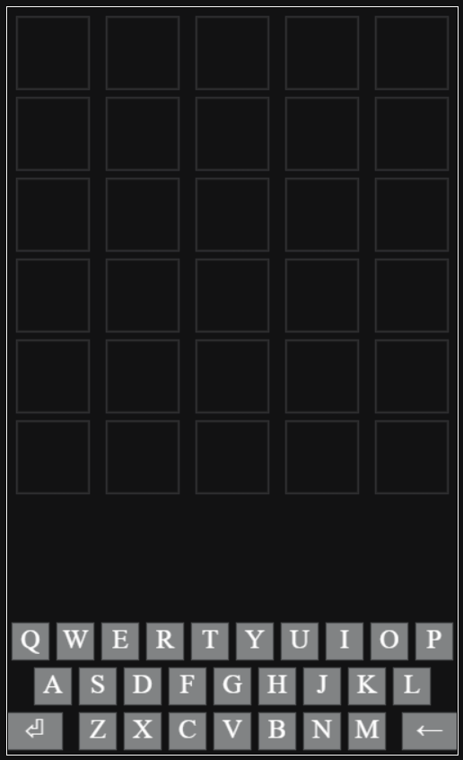
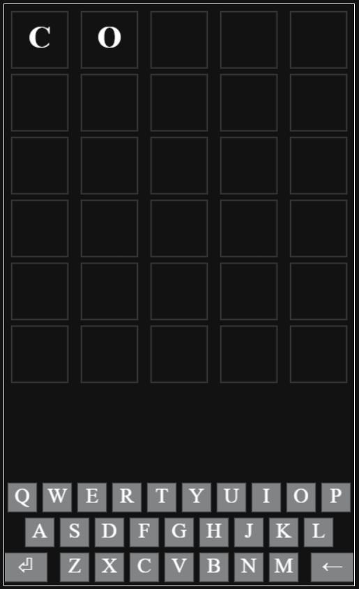
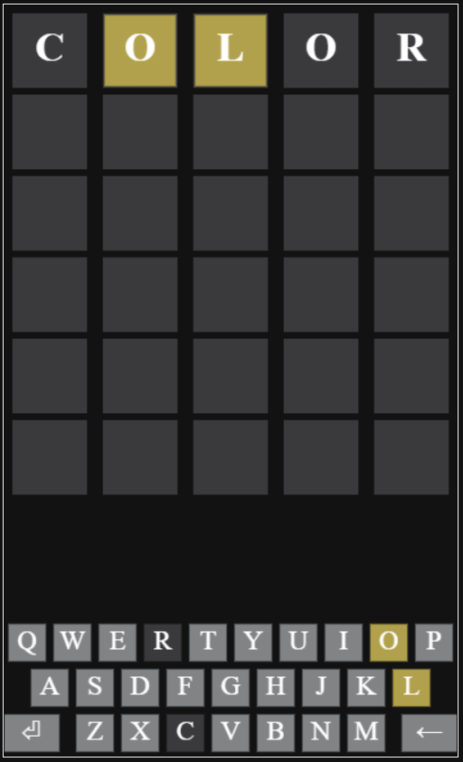
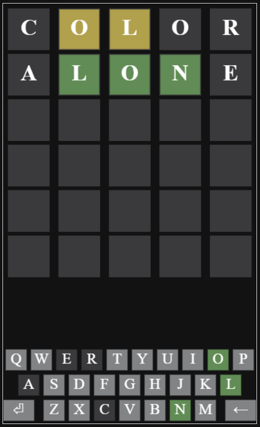
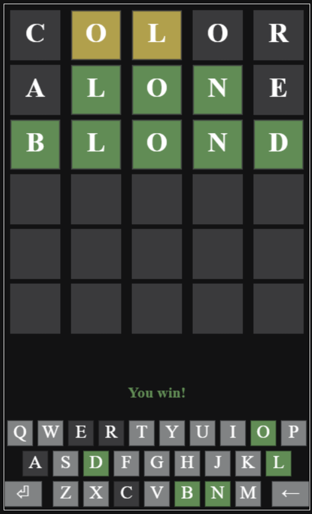
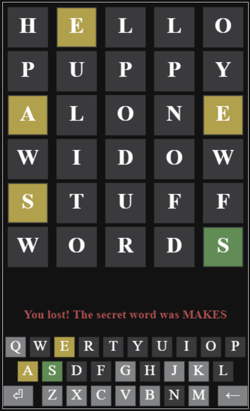

# Wordle in JavaScript 🚀

This project is a **JavaScript** implementation of the popular Wordle game! Players have 6 chances to guess a secret 5-letter word. After each guess, feedback is provided via a color-coded system that helps players understand which letters are correct and in the right position, which are in the word but misplaced, and which are not in the word at all.

## Features ✨

- **🎯 Word Guessing Challenge**:  
  Each guess must be a valid 5-letter English word. The player has **6 attempts** to guess the correct word. After each guess, feedback will be given using the Wordle color scheme.  
  - **"You won!"** is displayed if the word is guessed correctly within 6 tries.  
  - **"You lost!"** is displayed if the player runs out of guesses, and the correct word will be revealed.

- **🎨 Color-Coded Feedback**:  
  After each guess, the tiles change color to provide clues:
  - 🟩 **Green**: The letter is correct and in the correct position.
  - 🟨 **Yellow**: The letter is in the word but in the wrong position.
  - ⬛ **Gray**: The letter is not in the word.
    
  The on-screen keyboard also updates its keys with the same color scheme, providing immediate visual feedback.

- **⌨️ Keyboard Input**:  
  Players can guess words by either:
  - Typing on their **physical keyboard**, with support for **Enter** and **Backspace** keys.
  - Clicking on the **on-screen keyboard** with the same functionality as a physical keyboard.
  
  Both methods provide seamless interaction for word entry and corrections.

## How to Play 🕹️

1. **Start guessing**: Input a 5-letter word using the on-screen or physical keyboard.
   
   
3. **Submit your guess**: Press **Enter** to see the color-coded feedback.
  
  
4. **Make adjustments**: Use **Backspace** to correct your guess before submitting.
5. **Win or lose**: Keep guessing until you either guess the word correctly or run out of attempts!
  
  
